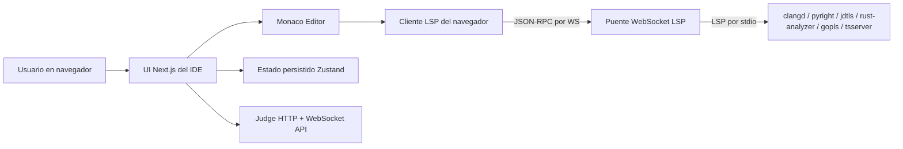
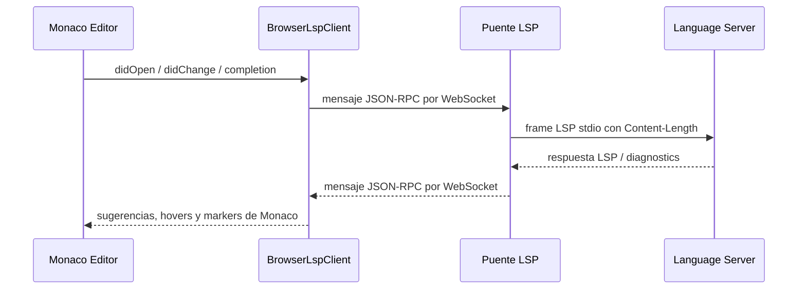
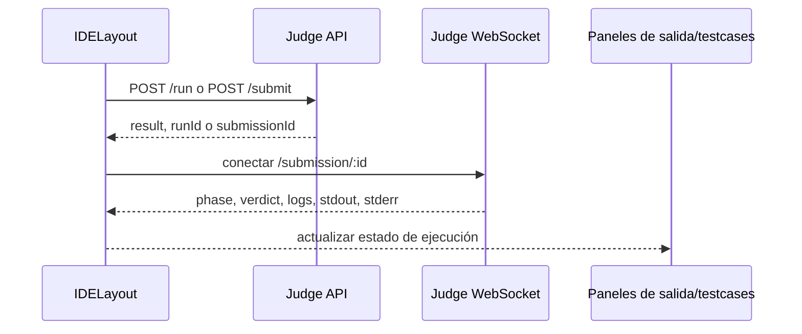

# Vibe Judge IDE

[English](README.md) · Español

Vibe Judge IDE es un IDE de programación competitiva en navegador construido con **Next.js**, **React**, **TypeScript**, **Tailwind CSS**, **Monaco Editor**, **Zustand** y un puente opcional **Language Server Protocol (LSP)** con Docker.

Está pensado para integraciones con jueces: escribir una solución de un solo archivo, recibir inteligencia del editor, ejecutar con entrada personalizada o testcases, enviar a un Judge API y recibir veredictos por WebSocket.

## Proyectos

Este repositorio contiene dos proyectos relacionados:

| Proyecto | Ruta | Propósito |
| --- | --- | --- |
| IDE web | raíz del repositorio | App Next.js, editor Monaco, estado UI, integración con juez y cliente LSP del navegador |
| Runtime LSP | [`lsp/`](lsp/README.es.md) | Puente WebSocket-a-stdio que inicia language servers reales en Docker |

## Funcionalidades

| Área | Capacidad |
| --- | --- |
| Editor | Monaco Editor, completions LSP, hover, diagnostics, signatures y code actions |
| Lenguajes | C++17, Python 3, Java 17, JavaScript, Rust y Go |
| Enunciado | Panel de problema en español con divisor movible entre enunciado y editor |
| Paneles | Output/input/testcases redimensionables |
| Temas | Oscuro, claro y terminal hacker |
| Persistencia | Código, lenguaje, testcases, tamaños de layout y tema se guardan localmente |
| Juez | Run/submit por HTTP y stream de estado por WebSocket |
| Token LSP | Token opcional entre navegador y puente LSP |

## Capturas

| Workspace del IDE | Autocompletado | Estado LSP y paneles |
| --- | --- | --- |
|  |  |  |

## Arquitectura



## Flujo LSP



## Flujo del Juez



## Estructura

| Ruta | Propósito |
| --- | --- |
| `app/` | Entradas de Next.js App Router y estilos globales |
| `components/` | Layout del IDE, editor, toolbar, paneles y botones |
| `hooks/` | Atajos de teclado y WebSocket de ejecución |
| `lib/` | Metadata de lenguajes, código inicial main y exports de configuración LSP |
| `lsp/` | Cliente LSP, adapter Monaco, descriptores de lenguaje y bridge Docker |
| `services/` | Cliente del Judge API |
| `store/` | Store Zustand con estado persistido |
| `types/` | Contratos TypeScript compartidos |

## Requisitos

- Node.js 20+ recomendado
- npm 10+
- Docker y Docker Compose para el bridge LSP local
- Backend de juez si quieres ejecución/envío real

## Inicio Rápido

```bash
git clone <repo-url>
cd vibe-ide
npm install
cp .env.example .env.local
npm run dev
```

Abre <http://localhost:3000>.

## Agregar el Bridge LSP

Desde la raíz:

```bash
npm run lsp:up
```

O en segundo plano:

```bash
npm run lsp:up:detached
npm run lsp:logs
```

Health check:

```bash
curl http://localhost:3001/healthz
```

Documentación dedicada:

- [README LSP en inglés](lsp/README.md)
- [README LSP en español](lsp/README.es.md)

## Variables de Entorno

| Variable | Requerida | Descripción | Ejemplo |
| --- | --- | --- | --- |
| `NEXT_PUBLIC_JUDGE_API_URL` | No | URL HTTP base del Judge API. | `http://localhost:8080` |
| `NEXT_PUBLIC_JUDGE_WS_URL` | No | URL WebSocket para estados del juez. Si se omite, se deriva de la URL HTTP. | `ws://localhost:8080` |
| `LSP_AUTH_TOKEN` | Sí para LSP | Token privado usado solo por el proxy LSP de Next.js al llamar al LSP server externo. No lo expongas con `NEXT_PUBLIC_*`. | `dev-lsp-token` |
| `LSP_SERVER_WS_BASE` | No | URL WebSocket base del LSP server externo alcanzado por el proxy Next.js. | `ws://127.0.0.1:3001` |
| `NEXT_PUBLIC_LSP_CPP_WS` | No | Endpoint proxy same-origin de Next.js para C++ `clangd`. | `/api/lsp/cpp` |
| `NEXT_PUBLIC_LSP_PYTHON_WS` | No | Endpoint proxy same-origin de Next.js para Python `pyright`. | `/api/lsp/python` |
| `NEXT_PUBLIC_LSP_JAVA_WS` | No | Endpoint proxy same-origin de Next.js para Java `jdtls`. | `/api/lsp/java` |
| `NEXT_PUBLIC_LSP_JAVASCRIPT_WS` | No | Endpoint proxy same-origin de Next.js para JavaScript/TypeScript. | `/api/lsp/js` |
| `NEXT_PUBLIC_LSP_RUST_WS` | No | Endpoint proxy same-origin de Next.js para Rust `rust-analyzer`. | `/api/lsp/rust` |
| `NEXT_PUBLIC_LSP_GO_WS` | No | Endpoint proxy same-origin de Next.js para Go `gopls`. | `/api/lsp/go` |

El navegador se conecta a esta app Next.js en `/api/lsp/*`. El proxy WebSocket de Next.js luego se conecta al LSP server externo con `LSP_AUTH_TOKEN` privado, así que ningún secreto LSP queda incluido en el bundle de Monaco.

## Ejemplo `.env.local`

```env
NEXT_PUBLIC_JUDGE_API_URL="http://localhost:8080"
NEXT_PUBLIC_JUDGE_WS_URL="ws://localhost:8080"

NEXT_PUBLIC_LSP_CPP_WS="/api/lsp/cpp"
NEXT_PUBLIC_LSP_PYTHON_WS="/api/lsp/python"
NEXT_PUBLIC_LSP_JAVA_WS="/api/lsp/java"
NEXT_PUBLIC_LSP_JAVASCRIPT_WS="/api/lsp/js"
NEXT_PUBLIC_LSP_RUST_WS="/api/lsp/rust"
NEXT_PUBLIC_LSP_GO_WS="/api/lsp/go"

LSP_AUTH_TOKEN="dev-lsp-token"
LSP_SERVER_WS_BASE="ws://127.0.0.1:3001"
```

## Contrato Judge API

El frontend espera:

```txt
POST /run
POST /submit
GET  /submission/:id
WS   /submission/:id
```

### `POST /run`

```json
{
  "sourceCode": "#include <bits/stdc++.h>...",
  "language": "cpp",
  "stdin": "5\n",
  "testcases": []
}
```

```json
{
  "runId": "run_123",
  "result": {
    "id": "run_123",
    "phase": "completed",
    "verdict": "Accepted",
    "stdout": "5\n",
    "stderr": "",
    "compileErrors": "",
    "logs": ["Finished."],
    "runtimeMs": 12,
    "memoryKb": 4096
  }
}
```

### `POST /submit`

```json
{ "submissionId": "sub_123" }
```

### Estado por WebSocket

```json
{
  "submissionId": "sub_123",
  "phase": "running",
  "verdict": "Pending",
  "logs": ["Compiling..."]
}
```

## Scripts

| Script | Descripción |
| --- | --- |
| `npm run dev` | Inicia Next.js en desarrollo |
| `npm run build` | Construye producción |
| `npm run start` | Inicia producción después de build |
| `npm run typecheck` | Ejecuta TypeScript sin emitir archivos |
| `npm run check` | Ejecuta typecheck y build |
| `npm run lsp:up` | Construye y ejecuta el bridge LSP Docker |
| `npm run lsp:up:detached` | Ejecuta el bridge LSP en segundo plano |
| `npm run lsp:logs` | Sigue logs del bridge LSP |
| `npm run lsp:down` | Detiene el bridge LSP |
| `npm run lsp:cache` | Pre-descarga runtimes grandes en `lsp/storage/` |

## Agregar un Lenguaje

1. Agrega el id en `types/ide.ts`.
2. Agrega metadata y código inicial main en `lib/language-options.ts`.
3. Agrega descriptor LSP en `lsp/integrations/<language>.ts`.
4. Regístralo en `lsp/integrations/index.ts`.
5. Agrega ruta y comando en `lsp/server/server.mjs`.
6. Documenta la nueva variable `NEXT_PUBLIC_LSP_*_WS`.

## Troubleshooting

| Síntoma | Causa probable | Solución |
| --- | --- | --- |
| `LSP: <server>` aparece disabled | Falta `NEXT_PUBLIC_LSP_*_WS` | Copia `.env.example` a `.env.local` y reinicia Next.js |
| LSP se desconecta al instante | Conflicto de puerto, token privado incorrecto o ruta no soportada | Revisa `LSP_AUTH_TOKEN`, `LSP_SERVER_WS_BASE`, `/healthz` externo y `npm run lsp:logs` |
| Fallan completions Java | `jdtls` espera que las clases públicas Java coincidan con el nombre del archivo | Mantén `lsp/document-uri.ts` alineado con el nombre del archivo del editor |
| Diagnostics C++ ruidosos | `clangd` necesita compile flags | Personaliza `/workspace/compile_flags.txt` |
| Run/Submit falla | Judge API no cumple el contrato | Verifica `NEXT_PUBLIC_JUDGE_API_URL` y rutas backend |
| No llegan veredictos por WS | URL WS del juez incorrecta o bloqueada | Configura `NEXT_PUBLIC_JUDGE_WS_URL` e inspecciona Network |

## Licencia

Agrega una licencia antes de publicar este repositorio como open source.
