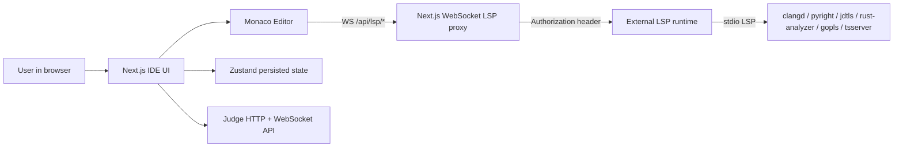
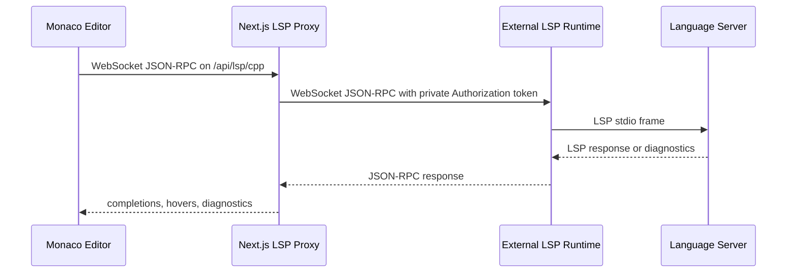
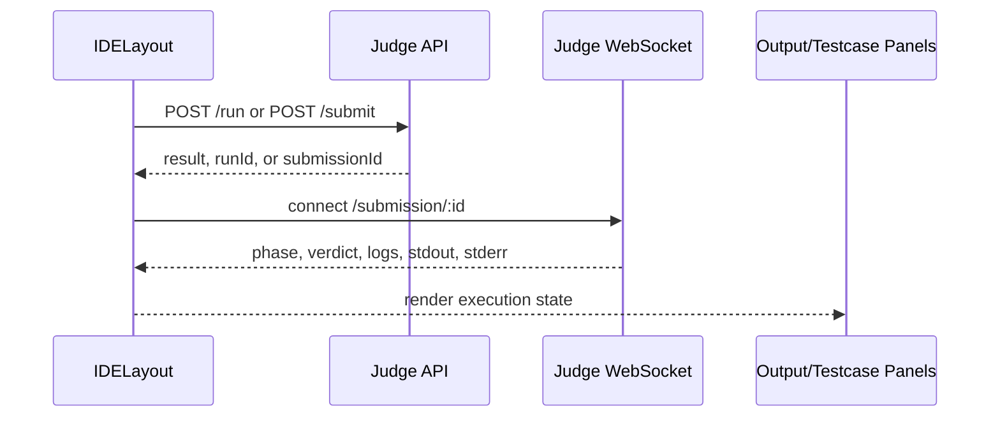

# Vibe Judge IDE

English · [Español](README.es.md)

Vibe Judge IDE is a browser-based competitive-programming workspace built with **Next.js**, **React**, **TypeScript**, **Tailwind CSS**, **Monaco Editor**, **Zustand**, and WebSocket integrations for judge and LSP workflows.

It is designed for online-judge platforms that need a focused coding UI: competitors can read the problem, write a single-file solution, run it with custom input or test cases, submit it to a judge backend, and follow execution status in real time.

## What this repository contains

This checkout contains the **web IDE**:

- Next.js application shell and custom WebSocket server (`server.mjs`).
- Monaco-based code editor.
- Persisted UI/code state with Zustand.
- Judge HTTP + WebSocket client integration.
- Browser-to-server LSP proxy routes under `/api/lsp/*`.

The actual language-server runtime is expected to run separately and be reachable through `LSP_SERVER_WS_BASE` (for example `ws://127.0.0.1:3001`). Some scripts still target a local `lsp/` companion directory; they only work when that directory is present in your checkout.

## Highlights

| Area | Capability |
| --- | --- |
| Editor | Monaco Editor with language-aware file names and configurable themes |
| Languages | C++17, Python 3, Java 17, JavaScript, Rust, and Go |
| Problem view | Built-in Spanish problem statement panel with a draggable split view |
| Execution UI | Separate panels for output, stdin, test cases, logs, runtime, and memory |
| Persistence | Code, selected language, test cases, layout sizes, minimap, and theme persist locally |
| Judge integration | `run`/`submit` HTTP calls plus WebSocket status updates |
| LSP proxy | Browser connects to `/api/lsp/<language>` while the server forwards the private token upstream |
| Shortcuts | `Ctrl+Enter` to run, `Ctrl+Space` for editor suggestions |

## Screenshots

### IDE workspace


### Completion UI


### LSP status and panels


## Architecture



### LSP message flow



### Judge flow



## Folder structure

| Path | Purpose |
| --- | --- |
| `app/` | Next.js App Router entry points and global styles |
| `components/` | IDE layout, editor, toolbar, status badges, and panels |
| `docs/assets/` | README screenshots |
| `hooks/` | Keyboard shortcuts, panel resize, toast, LSP editor wiring, and judge actions |
| `lib/` | Language metadata, UI config, verdict helpers, themes, and error formatting |
| `services/` | HTTP, judge API, file download, and LSP client exports |
| `store/` | Zustand store and default persisted state |
| `types/` | Shared TypeScript contracts |
| `server.mjs` | Custom Next.js server plus `/api/lsp/*` WebSocket proxy |

## Requirements

- Node.js 20+ recommended
- npm 10+
- A judge backend if you want real run/submit execution
- Optional: an external LSP runtime listening on `LSP_SERVER_WS_BASE`
- Optional: Docker and Docker Compose if your checkout includes the companion `lsp/` runtime directory

## Quick start

```bash
git clone <repo-url>
cd vibe-ide
npm install
cp .env.example .env.local
npm run dev
```

Open <http://localhost:3000>.

If you only want to inspect the UI, the judge backend and LSP runtime can be offline. Run/submit and LSP features will show connection errors until their services are available.

## Configure the judge backend

The frontend expects these endpoints:

```txt
POST /run
POST /submit
GET  /submission/:id
WS   /submission/:id
```

Set the judge URLs in `.env.local`:

```env
NEXT_PUBLIC_JUDGE_API_URL="http://localhost:8080"
NEXT_PUBLIC_JUDGE_WS_URL="ws://localhost:8080"
```

If `NEXT_PUBLIC_JUDGE_WS_URL` is omitted, the app derives it from `NEXT_PUBLIC_JUDGE_API_URL`.

## Configure LSP

The browser should not know the private LSP token. Monaco connects only to same-origin proxy URLs:

```env
NEXT_PUBLIC_LSP_CPP_WS="/api/lsp/cpp"
NEXT_PUBLIC_LSP_PYTHON_WS="/api/lsp/python"
NEXT_PUBLIC_LSP_JAVA_WS="/api/lsp/java"
NEXT_PUBLIC_LSP_JAVASCRIPT_WS="/api/lsp/js"
NEXT_PUBLIC_LSP_RUST_WS="/api/lsp/rust"
NEXT_PUBLIC_LSP_GO_WS="/api/lsp/go"
```

`server.mjs` receives those WebSocket upgrades, then connects to the external LSP runtime with a private server-side token:

```env
LSP_AUTH_TOKEN="dev-lsp-token"
LSP_SERVER_WS_BASE="ws://127.0.0.1:3001"
```

Do **not** rename `LSP_AUTH_TOKEN` to `NEXT_PUBLIC_*`; anything with `NEXT_PUBLIC_` is bundled into browser code.

Expected upstream routes from the external LSP runtime:

```txt
/lsp/java
/lsp/cpp
/lsp/python
/lsp/js
/lsp/rust
/lsp/go
```

## Example `.env.local`

```env
NEXT_PUBLIC_JUDGE_API_URL="http://localhost:8080"
NEXT_PUBLIC_JUDGE_WS_URL="ws://localhost:8080"

NEXT_PUBLIC_LSP_CPP_WS="/api/lsp/cpp"
NEXT_PUBLIC_LSP_PYTHON_WS="/api/lsp/python"
NEXT_PUBLIC_LSP_JAVA_WS="/api/lsp/java"
NEXT_PUBLIC_LSP_JAVASCRIPT_WS="/api/lsp/js"
NEXT_PUBLIC_LSP_RUST_WS="/api/lsp/rust"
NEXT_PUBLIC_LSP_GO_WS="/api/lsp/go"

LSP_AUTH_TOKEN="dev-lsp-token"
LSP_SERVER_WS_BASE="ws://127.0.0.1:3001"
```

## Judge API contract

### `POST /run`

Request:

```json
{
  "sourceCode": "#include <bits/stdc++.h>...",
  "language": "cpp",
  "stdin": "5\n",
  "testcases": []
}
```

Response:

```json
{
  "runId": "run_123",
  "result": {
    "id": "run_123",
    "phase": "completed",
    "verdict": "Accepted",
    "stdout": "5\n",
    "stderr": "",
    "compileErrors": "",
    "logs": ["Finished."],
    "runtimeMs": 12,
    "memoryKb": 4096
  }
}
```

### `POST /submit`

```json
{ "submissionId": "sub_123" }
```

### WebSocket status message

```json
{
  "submissionId": "sub_123",
  "phase": "running",
  "verdict": "Pending",
  "logs": ["Compiling..."]
}
```

## Scripts

| Script | Description |
| --- | --- |
| `npm run dev` | Start the custom Next.js development server (`server.mjs`) |
| `npm run build` | Build the production app |
| `npm run start` | Start the custom production server after building |
| `npm run typecheck` | Run TypeScript without emitting files |
| `npm run lint` | Alias for `npm run typecheck` |
| `npm run check` | Run typecheck and production build |
| `npm run lsp:up` | Build and run the companion Docker LSP runtime when `lsp/docker-compose.yml` exists |
| `npm run lsp:up:detached` | Run the companion LSP runtime in the background when available |
| `npm run lsp:logs` | Follow companion LSP runtime logs when available |
| `npm run lsp:down` | Stop the companion LSP runtime when available |
| `npm run lsp:cache` | Pre-download companion LSP runtime archives when available |

## Add a language

1. Add the language id and shared types in `types/ide.ts`.
2. Add display metadata, Monaco language id, file extension, and starter code in `lib/language-options.ts`.
3. Add or update the frontend LSP config for the new `NEXT_PUBLIC_LSP_*_WS` variable.
4. Add a `/api/lsp/<language>` proxy route in `server.mjs`.
5. Ensure the external LSP runtime exposes `/lsp/<language>`.
6. Document the new environment variable in both README files and `.env.example`.

## Troubleshooting

| Symptom | Likely cause | Fix |
| --- | --- | --- |
| `LSP: <server>` shows disabled | Missing `NEXT_PUBLIC_LSP_*_WS` variable | Copy `.env.example` to `.env.local` and restart `npm run dev` |
| LSP disconnects immediately | Missing `LSP_AUTH_TOKEN`, wrong token, wrong upstream URL, or external LSP runtime is down | Check `.env.local`, `LSP_SERVER_WS_BASE`, and the external runtime logs |
| Browser shows token concerns | Token was exposed with a `NEXT_PUBLIC_*` variable | Keep the secret as `LSP_AUTH_TOKEN` only; Monaco should only call `/api/lsp/*` |
| Run/submit fails | Judge API does not implement the expected contract | Verify `NEXT_PUBLIC_JUDGE_API_URL` and backend routes |
| WebSocket verdicts do not arrive | Judge WebSocket URL is wrong or blocked | Set `NEXT_PUBLIC_JUDGE_WS_URL` explicitly and inspect the browser Network tab |
| LSP scripts fail with missing `lsp/docker-compose.yml` | This checkout does not include the companion LSP runtime directory | Run an external LSP runtime separately or restore/add the companion `lsp/` project |

## License

Add a license before publishing this repository as open source.
