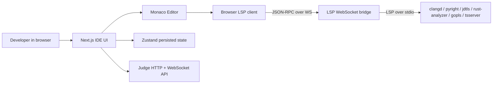
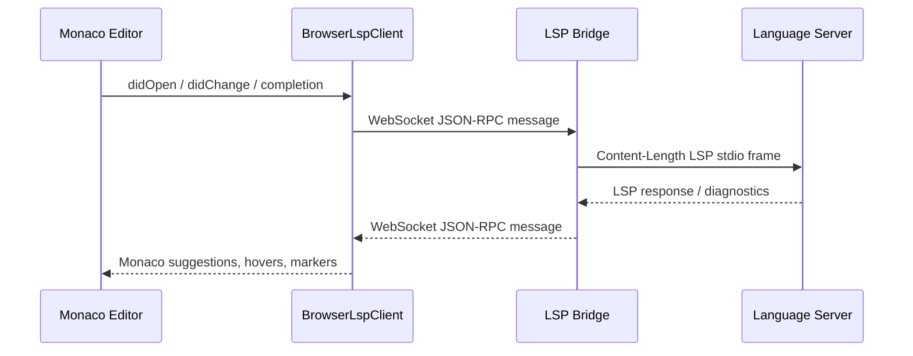
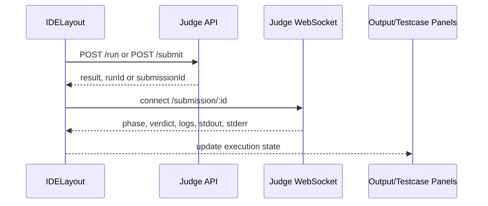

# Vibe Judge IDE

English · [Español](README.es.md)

Vibe Judge IDE is a browser-based competitive-programming IDE built with **Next.js**, **React**, **TypeScript**, **Tailwind CSS**, **Monaco Editor**, **Zustand**, and an optional Dockerized **Language Server Protocol (LSP)** bridge.

It is designed for judge integrations: write one solution file, get editor intelligence, run with custom input or testcases, submit to a judge API, and stream verdict updates back into the UI.

## Projects

This repository contains two closely related projects:

| Project | Path | Purpose |
| --- | --- | --- |
| Web IDE | repository root | Next.js application, Monaco editor, UI state, judge API integration and browser-side LSP client |
| LSP runtime | [`lsp/`](lsp/README.md) | WebSocket-to-stdio bridge that starts real language servers in Docker |

## Features

| Area | Capability |
| --- | --- |
| Editor | Monaco Editor, LSP completions, hover, diagnostics, signatures and code actions |
| Languages | C++17, Python 3, Java 17, JavaScript, Rust and Go |
| Problem view | Spanish problem statement panel with a draggable divider between statement and editor |
| Panels | Resizable output/input/testcase panel |
| Themes | Dark, light and hacker terminal themes |
| Persistence | Code entered by the user, selected language, testcases, layout sizes and theme are persisted locally |
| Judge | HTTP run/submit calls plus WebSocket submission status stream |
| LSP auth | Optional token between browser and LSP bridge |

## Screenshots

### IDE workspace


### Completion UI


### LSP status and panels


## Architecture



## LSP Flow



## Judge Flow



## Folder Structure

| Path | Purpose |
| --- | --- |
| `app/` | Next.js App Router entry points and global styles |
| `components/` | IDE layout, editor, toolbar, panels and buttons |
| `hooks/` | Keyboard shortcuts and execution WebSocket handling |
| `lib/` | Language metadata, starter main code, and LSP config exports |
| `lsp/` | Browser LSP client, Monaco adapter, language descriptors and Docker LSP bridge |
| `services/` | Judge API client |
| `store/` | Zustand store with persisted IDE state |
| `types/` | Shared TypeScript contracts |

## Requirements

- Node.js 20+ recommended
- npm 10+
- Docker and Docker Compose for the local LSP bridge
- A judge backend if you want real run/submit execution

## Quick Start

```bash
git clone <repo-url>
cd vibe-ide
npm install
cp .env.example .env.local
npm run dev
```

Open <http://localhost:3000>.

## Add the LSP Bridge

Start the Dockerized LSP runtime from the repository root:

```bash
npm run lsp:up
```

Or detached:

```bash
npm run lsp:up:detached
npm run lsp:logs
```

Check health:

```bash
curl http://localhost:3001/healthz
```

See the dedicated LSP documentation:

- [English LSP README](lsp/README.md)
- [Spanish LSP README](lsp/README.es.md)

## Environment Variables

| Variable | Required | Description | Example |
| --- | --- | --- | --- |
| `NEXT_PUBLIC_JUDGE_API_URL` | No | Base HTTP URL for the judge API. | `http://localhost:8080` |
| `NEXT_PUBLIC_JUDGE_WS_URL` | No | Base WebSocket URL for judge status. If omitted, it is derived from the HTTP URL. | `ws://localhost:8080` |
| `LSP_AUTH_TOKEN` | Yes for LSP | Private token used only by the Next.js LSP proxy when calling the external LSP server. Do not expose it with `NEXT_PUBLIC_*`. | `dev-lsp-token` |
| `LSP_SERVER_WS_BASE` | No | External LSP server WebSocket base URL reached by the Next.js proxy. | `ws://127.0.0.1:3001` |
| `NEXT_PUBLIC_LSP_CPP_WS` | No | Same-origin Next.js proxy endpoint for C++ `clangd`. | `/api/lsp/cpp` |
| `NEXT_PUBLIC_LSP_PYTHON_WS` | No | Same-origin Next.js proxy endpoint for Python `pyright`. | `/api/lsp/python` |
| `NEXT_PUBLIC_LSP_JAVA_WS` | No | Same-origin Next.js proxy endpoint for Java `jdtls`. | `/api/lsp/java` |
| `NEXT_PUBLIC_LSP_JAVASCRIPT_WS` | No | Same-origin Next.js proxy endpoint for JavaScript/TypeScript. | `/api/lsp/js` |
| `NEXT_PUBLIC_LSP_RUST_WS` | No | Same-origin Next.js proxy endpoint for Rust `rust-analyzer`. | `/api/lsp/rust` |
| `NEXT_PUBLIC_LSP_GO_WS` | No | Same-origin Next.js proxy endpoint for Go `gopls`. | `/api/lsp/go` |

The browser connects to this Next.js app at `/api/lsp/*`. The Next.js WebSocket proxy then connects to the external LSP server with the private `LSP_AUTH_TOKEN`, so no LSP secret is bundled into Monaco.

## Example `.env.local`

```env
NEXT_PUBLIC_JUDGE_API_URL="http://localhost:8080"
NEXT_PUBLIC_JUDGE_WS_URL="ws://localhost:8080"

NEXT_PUBLIC_LSP_CPP_WS="/api/lsp/cpp"
NEXT_PUBLIC_LSP_PYTHON_WS="/api/lsp/python"
NEXT_PUBLIC_LSP_JAVA_WS="/api/lsp/java"
NEXT_PUBLIC_LSP_JAVASCRIPT_WS="/api/lsp/js"
NEXT_PUBLIC_LSP_RUST_WS="/api/lsp/rust"
NEXT_PUBLIC_LSP_GO_WS="/api/lsp/go"

LSP_AUTH_TOKEN="dev-lsp-token"
LSP_SERVER_WS_BASE="ws://127.0.0.1:3001"
```

## Judge API Contract

The frontend expects:

```txt
POST /run
POST /submit
GET  /submission/:id
WS   /submission/:id
```

### `POST /run`

```json
{
  "sourceCode": "#include <bits/stdc++.h>...",
  "language": "cpp",
  "stdin": "5\n",
  "testcases": []
}
```

```json
{
  "runId": "run_123",
  "result": {
    "id": "run_123",
    "phase": "completed",
    "verdict": "Accepted",
    "stdout": "5\n",
    "stderr": "",
    "compileErrors": "",
    "logs": ["Finished."],
    "runtimeMs": 12,
    "memoryKb": 4096
  }
}
```

### `POST /submit`

```json
{ "submissionId": "sub_123" }
```

### WebSocket Status

```json
{
  "submissionId": "sub_123",
  "phase": "running",
  "verdict": "Pending",
  "logs": ["Compiling..."]
}
```

## Scripts

| Script | Description |
| --- | --- |
| `npm run dev` | Start the Next.js development server |
| `npm run build` | Build the production app |
| `npm run start` | Start the production server after build |
| `npm run typecheck` | Run TypeScript without emitting files |
| `npm run check` | Run typecheck and production build |
| `npm run lsp:up` | Build and run the Dockerized LSP bridge |
| `npm run lsp:up:detached` | Run the LSP bridge in the background |
| `npm run lsp:logs` | Follow LSP bridge logs |
| `npm run lsp:down` | Stop the LSP bridge |
| `npm run lsp:cache` | Pre-download large LSP runtime archives into `lsp/storage/` |

## Add a Language

1. Add the language id to `types/ide.ts`.
2. Add display metadata and starter main code in `lib/language-options.ts`.
3. Add an LSP descriptor in `lsp/integrations/<language>.ts`.
4. Register it in `lsp/integrations/index.ts`.
5. Add a bridge route and command in `lsp/server/server.mjs`.
6. Document the new `NEXT_PUBLIC_LSP_*_WS` variable.

## Troubleshooting

| Symptom | Likely cause | Fix |
| --- | --- | --- |
| `LSP: <server>` shows disabled | Missing `NEXT_PUBLIC_LSP_*_WS` variable | Copy `.env.example` to `.env.local` and restart Next.js |
| LSP disconnects immediately | Port conflict, private token mismatch, or unsupported route | Check `LSP_AUTH_TOKEN`, `LSP_SERVER_WS_BASE`, external `/healthz`, and `npm run lsp:logs` |
| Java completions fail | `jdtls` expects Java public classes to match the file name | Keep `lsp/document-uri.ts` aligned with the editor file name |
| C++ diagnostics are noisy | `clangd` needs compile flags | Customize `/workspace/compile_flags.txt` |
| Run/Submit fails | Judge API does not implement the expected contract | Verify `NEXT_PUBLIC_JUDGE_API_URL` and backend routes |
| WebSocket verdicts do not arrive | Judge WS URL is wrong or blocked | Set `NEXT_PUBLIC_JUDGE_WS_URL` explicitly and inspect the browser network tab |

## License

Add a license before publishing this repository as open source.
