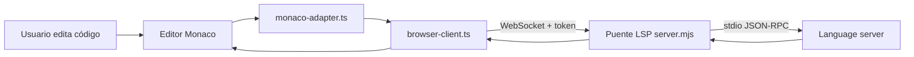
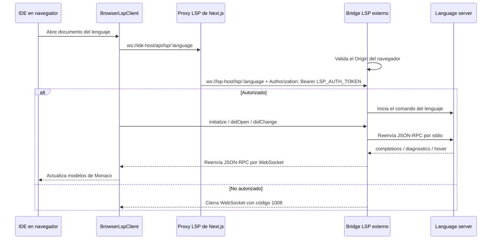

# Runtime LSP de Vibe IDE

[English](README.md) · [Español](README.es.md)

Este proyecto es el runtime de inteligencia de lenguaje para Vibe Judge IDE. Incluye los adaptadores LSP que usa Monaco en el navegador y un puente Dockerizado WebSocket-a-stdio que inicia servidores de lenguaje reales.

Usalo cuando el IDE necesite autocompletado, diagnósticos, hover y comportamiento de editor con soporte de lenguaje para Java, C++, Python, JavaScript, Rust y Go.

## Capturas

El runtime LSP alimenta el autocompletado del editor y los indicadores de estado que se ven en el IDE principal.

### Autocompletado


### Estado LSP y paneles


## Cómo Se Integra

El IDE en Next.js no habla directamente con los servidores de lenguaje. El navegador abre un WebSocket por lenguaje, el puente valida el token opcional y después reenvía mensajes JSON-RPC entre Monaco y el proceso del language server seleccionado.





## Piezas Del Runtime

| Ruta | Propósito |
| --- | --- |
| `browser-client.ts` | Cliente LSP por WebSocket usado por el IDE en el navegador. |
| `monaco-adapter.ts` | Conecta modelos, diagnósticos y providers de Monaco con el cliente LSP. |
| `integrations/*` | Configuración Monaco/LSP por lenguaje. |
| `server/server.mjs` | Puente Node WebSocket-a-stdio. |
| `Dockerfile` | Instala los language servers y runtimes necesarios. |
| `docker-compose.yml` | Ejecuta el puente en el puerto `3001` y monta `/workspace`. |
| `storage/` | Cache local opcional para archivos de Go, Java y JDTLS. |

## Rutas

| Ruta WebSocket | Language server |
| --- | --- |
| `ws://localhost:3001/lsp/java` | Eclipse JDT Language Server (`jdtls`) |
| `ws://localhost:3001/lsp/cpp` | `clangd` |
| `ws://localhost:3001/lsp/python` | `pyright-langserver --stdio` |
| `ws://localhost:3001/lsp/js` | `typescript-language-server --stdio` |
| `ws://localhost:3001/lsp/rust` | `rust-analyzer` |
| `ws://localhost:3001/lsp/go` | `gopls serve` |

## Autenticación

La autenticación se divide entre el proxy Next.js y el bridge LSP externo:

1. El navegador usa `/api/lsp/:language` same-origin en la app Next.js y no recibe ningún token LSP.
2. El proxy Next.js abre la ruta `/lsp/:language` del LSP server externo con `LSP_AUTH_TOKEN` privado como header server-side `Authorization: Bearer`.

```env
# lsp/.env, leído solo por Docker/server runtime
LSP_AUTH_TOKEN="dev-lsp-token"
```

`LSP_AUTH_TOKEN` es obligatorio; el bridge se niega a iniciar sin ese valor.

No uses `NEXT_PUBLIC_LSP_AUTH_TOKEN`; cualquier valor `NEXT_PUBLIC_*` queda incluido en el navegador y no es secreto.

## Ejecutar Con Docker Compose

Desde la raíz del repositorio:

```bash
npm run lsp:up
```

Comando directo equivalente:

```bash
docker compose -f lsp/docker-compose.yml up --build
```

Después ejecutá el IDE en otra terminal:

```bash
npm run dev
```

El bridge externo escucha en `http://localhost:3001` y expone rutas WebSocket protegidas por token bajo `/lsp/:language`. El navegador debe conectarse al proxy de la app Next.js bajo `/api/lsp/:language`, no directamente a este bridge externo.

## Configurar El IDE

Creá `.env.local` en la raíz del repositorio:

```env
NEXT_PUBLIC_LSP_JAVA_WS="/api/lsp/java"
NEXT_PUBLIC_LSP_CPP_WS="/api/lsp/cpp"
NEXT_PUBLIC_LSP_PYTHON_WS="/api/lsp/python"
NEXT_PUBLIC_LSP_JAVASCRIPT_WS="/api/lsp/js"
NEXT_PUBLIC_LSP_RUST_WS="/api/lsp/rust"
NEXT_PUBLIC_LSP_GO_WS="/api/lsp/go"

LSP_AUTH_TOKEN="dev-lsp-token"
LSP_SERVER_WS_BASE="ws://127.0.0.1:3001"
```

Configura el secreto del bridge externo en `lsp/.env`, y configura el mismo secreto más la URL upstream en el entorno de la app Next.js:

```env
LSP_AUTH_TOKEN="dev-lsp-token"
```

## Health Check

```bash
curl http://localhost:3001/healthz
```

Respuesta esperada:

```json
{"ok":true,"languages":["java","cpp","python","js","rust","go"]}
```

## Builds Docker Más Rápidos

La imagen Docker puede instalar Go, Java y JDTLS desde archivos locales en `lsp/storage/` en vez de descargarlos en cada rebuild sin cache.

Primero llená el cache:

```bash
npm run lsp:cache
```

Después construí normalmente:

```bash
npm run lsp:up
```

Los nombres esperados de los archivos están documentados en `storage/README.md`. Los volúmenes nombrados de Docker sirven en runtime, pero no están disponibles durante `docker build`; por eso el cache de build vive en `lsp/storage/`.

## Sobrescribir Comandos De Language Servers

Cada comando de language server se puede sobrescribir con variables de entorno:

| Lenguaje | Variables de comando |
| --- | --- |
| Java | `LSP_JAVA_COMMAND`, `LSP_JAVA_ARGS` |
| C++ | `LSP_CPP_COMMAND`, `LSP_CPP_ARGS` |
| Python | `LSP_PYTHON_COMMAND`, `LSP_PYTHON_ARGS` |
| JavaScript | `LSP_JAVASCRIPT_COMMAND`, `LSP_JAVASCRIPT_ARGS` |
| Rust | `LSP_RUST_COMMAND`, `LSP_RUST_ARGS` |
| Go | `LSP_GO_COMMAND`, `LSP_GO_ARGS` |

Ejemplo:

```bash
LSP_CPP_ARGS="--background-index --clang-tidy" npm run lsp:up
```

## Workspace

El compose monta `lsp/server/workspace` como `/workspace` dentro del contenedor. Monaco abre archivos como:

```text
file:///workspace/main.cpp
file:///workspace/Main.java
```

JDTLS usa un workspace interno separado en `/tmp/jdtls-workspace`. Mantenelo fuera de `/workspace`; si no, JDTLS no puede crear su proyecto invisible para documentos Java de un solo archivo y completions como `Integer.` pueden volver vacías.

## Agregar Un Lenguaje

1. Instalá el language server en `Dockerfile`.
2. Agregá el comando y la ruta en `server/server.mjs`.
3. Agregá una integración de navegador en `integrations/`.
4. Registrá el endpoint en las variables de entorno del IDE.
5. Agregá configuración de lenguaje de Monaco si Monaco no la incluye.
6. Iniciá el puente y verificá `/healthz` más una solicitud real de autocompletado en el editor.

## Solución De Problemas

| Problema | Qué revisar |
| --- | --- |
| El WebSocket cierra con `1008` | Revisa que la app Next.js y el bridge LSP externo compartan `LSP_AUTH_TOKEN`, y que el IDE use `/api/lsp/:language`. |
| Java no muestra completions | Confirmá que JDTLS arranca con Java 21+ y usa `/tmp/jdtls-workspace`. |
| Falta Rust o Go server | Reconstruí la imagen Docker y revisá los logs de instalación. |
| El IDE no tiene funciones LSP | Confirmá que las variables `NEXT_PUBLIC_LSP_*_WS` apuntan al puerto `3001`. |
| El rebuild Docker tarda mucho | Ejecutá `npm run lsp:cache` y reconstruí con el cache local. |
