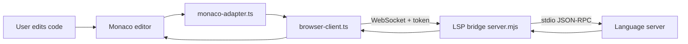
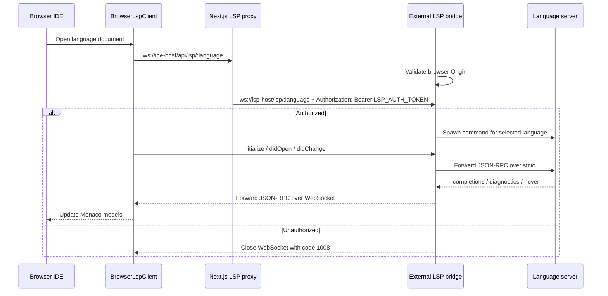

# Vibe IDE LSP Runtime

[English](README.md) · [Español](README.es.md)

This project is the language intelligence runtime for the Vibe Judge IDE. It provides the browser-side Monaco LSP adapters and a Dockerized WebSocket bridge that starts real language servers over stdio.

Use it when the IDE needs completions, diagnostics, hover information and language-aware editor behavior for Java, C++, Python, JavaScript, Rust and Go.

## Screenshots

The LSP runtime powers the editor completion UI and status indicators shown in the main IDE.

### Completion UI


### LSP status and panels


## How It Integrates

The Next.js IDE never talks to language servers directly. The browser opens a WebSocket per language, the external bridge validates the required token, and then the bridge forwards JSON-RPC messages between Monaco and the selected language server process.





## Runtime Pieces

| Path | Purpose |
| --- | --- |
| `browser-client.ts` | Browser WebSocket LSP client used by the IDE. |
| `monaco-adapter.ts` | Connects Monaco models, diagnostics and providers to the LSP client. |
| `integrations/*` | Per-language Monaco and LSP integration settings. |
| `server/server.mjs` | Node WebSocket-to-stdio bridge. |
| `Dockerfile` | Installs language servers and required runtimes. |
| `docker-compose.yml` | Runs the bridge on port `3001` and mounts `/workspace`. |
| `storage/` | Optional local build cache for Go, Java and JDTLS archives. |

## Routes

| WebSocket route | Language server |
| --- | --- |
| `ws://localhost:3001/lsp/java` | Eclipse JDT Language Server (`jdtls`) |
| `ws://localhost:3001/lsp/cpp` | `clangd` |
| `ws://localhost:3001/lsp/python` | `pyright-langserver --stdio` |
| `ws://localhost:3001/lsp/js` | `typescript-language-server --stdio` |
| `ws://localhost:3001/lsp/rust` | `rust-analyzer` |
| `ws://localhost:3001/lsp/go` | `gopls serve` |

## Authentication

Authentication is split between the Next.js proxy and the external LSP bridge:

1. Browser connections use same-origin `/api/lsp/:language` on the Next.js app and do not receive any LSP token.
2. The Next.js proxy opens the external LSP server `/lsp/:language` route with the private `LSP_AUTH_TOKEN` as a server-side `Authorization: Bearer` header.

```env
# lsp/.env, read only by Docker/server runtime
LSP_AUTH_TOKEN="dev-lsp-token"
```

`LSP_AUTH_TOKEN` is required; the bridge refuses to start without it.

Do not use `NEXT_PUBLIC_LSP_AUTH_TOKEN`; any `NEXT_PUBLIC_*` value is bundled into the browser and is not a secret.

## Run With Docker Compose

From the repository root:

```bash
npm run lsp:up
```

Equivalent direct command:

```bash
docker compose -f lsp/docker-compose.yml up --build
```

Then run the IDE in another terminal:

```bash
npm run dev
```

The external bridge listens on `http://localhost:3001` and exposes token-protected WebSocket routes under `/lsp/:language`. The browser should connect to the Next.js app proxy under `/api/lsp/:language`, not to this external bridge directly.

## Configure The IDE

Create `.env.local` at the repository root:

```env
NEXT_PUBLIC_LSP_JAVA_WS="/api/lsp/java"
NEXT_PUBLIC_LSP_CPP_WS="/api/lsp/cpp"
NEXT_PUBLIC_LSP_PYTHON_WS="/api/lsp/python"
NEXT_PUBLIC_LSP_JAVASCRIPT_WS="/api/lsp/js"
NEXT_PUBLIC_LSP_RUST_WS="/api/lsp/rust"
NEXT_PUBLIC_LSP_GO_WS="/api/lsp/go"

LSP_AUTH_TOKEN="dev-lsp-token"
LSP_SERVER_WS_BASE="ws://127.0.0.1:3001"
```

Configure the external bridge secret in `lsp/.env`, and configure the same secret plus upstream URL in the Next.js app environment:

```env
LSP_AUTH_TOKEN="dev-lsp-token"
```

## Health Check

```bash
curl http://localhost:3001/healthz
```

Expected response:

```json
{"ok":true,"languages":["java","cpp","python","js","rust","go"]}
```

## Faster Docker Builds

The Docker image can install Go, Java and JDTLS from local archives in `lsp/storage/` instead of downloading them on every uncached rebuild.

Populate the cache:

```bash
npm run lsp:cache
```

Build normally after the cache exists:

```bash
npm run lsp:up
```

Expected archive names are documented in `storage/README.md`. Docker named volumes are useful at runtime, but they are not available during `docker build`; this is why build archives live under `lsp/storage/`.

## Override Language Server Commands

Every language server command can be overridden with environment variables:

| Language | Command variables |
| --- | --- |
| Java | `LSP_JAVA_COMMAND`, `LSP_JAVA_ARGS` |
| C++ | `LSP_CPP_COMMAND`, `LSP_CPP_ARGS` |
| Python | `LSP_PYTHON_COMMAND`, `LSP_PYTHON_ARGS` |
| JavaScript | `LSP_JAVASCRIPT_COMMAND`, `LSP_JAVASCRIPT_ARGS` |
| Rust | `LSP_RUST_COMMAND`, `LSP_RUST_ARGS` |
| Go | `LSP_GO_COMMAND`, `LSP_GO_ARGS` |

Example:

```bash
LSP_CPP_ARGS="--background-index --clang-tidy" npm run lsp:up
```

## Workspace

The compose file mounts `lsp/server/workspace` to `/workspace` in the container. Monaco opens files like:

```text
file:///workspace/main.cpp
file:///workspace/Main.java
```

JDTLS uses a separate internal Eclipse workspace at `/tmp/jdtls-workspace`. Keep it outside `/workspace`; otherwise JDTLS cannot create its invisible project for single-file Java documents and Java completions such as `Integer.` can return empty results.

## Add A Language

1. Install the language server in `Dockerfile`.
2. Add the command and route to `server/server.mjs`.
3. Add a browser integration file under `integrations/`.
4. Register the endpoint in the IDE environment variables.
5. Add Monaco language configuration if Monaco does not already include it.
6. Start the bridge and verify `/healthz` plus one editor completion request.

## Troubleshooting

| Problem | Check |
| --- | --- |
| WebSocket closes with `1008` | Check that the Next.js app and external LSP bridge share `LSP_AUTH_TOKEN`, and that the IDE URL uses `/api/lsp/:language`. |
| Java completions are empty | Confirm JDTLS starts with Java 21+ and uses `/tmp/jdtls-workspace`. |
| Rust or Go server is missing | Rebuild the Docker image and check the install logs. |
| IDE has no LSP features | Confirm the `NEXT_PUBLIC_LSP_*_WS` variables point to port `3001`. |
| Docker rebuild is slow | Run `npm run lsp:cache` and rebuild with the local archive cache. |
